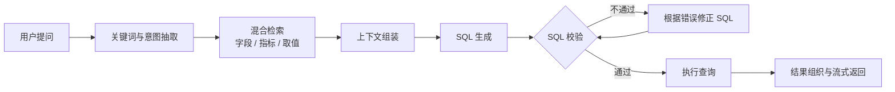

练习"电商问数"项目时，我第一次系统接触了 LangGraph。一开始我以为它只是又一个流程编排库，真正写过一遍才发现，它解决的是我此前写多步骤 Agent 时最头疼的三个问题：**状态放在哪里、步骤怎么串起来、出错之后怎么回退**。这篇笔记记录我的理解。

### 一、为什么需要把流程画成"图"

用大模型做多步骤任务时，最直觉的写法是把所有逻辑塞进一个函数：调模型、拿结果、再调模型、再处理。步骤一多，问题就来了：

- 中间结果没地方放，变量越滚越多，函数越来越长
- 某一步失败后无法从该步骤重试，只能整个流程重跑
- 想加一个"校验不通过就回头重新生成"的分支，代码立刻变成一团 `if-else`

LangGraph 的思路是把流程显式地写成一张**图**：节点是步骤，边是跳转关系，状态在节点之间流动。流程从"藏在代码里的隐式逻辑"变成了"看得见的结构"。

### 二、四个核心概念

1. **State（状态）**：整张图共享的一份数据，通常用字典结构定义。每个节点只返回自己需要更新的字段，由框架负责合并。
2. **Node（节点）**：一个普通函数，输入是当前状态，输出是要更新的状态片段。
3. **Edge（边）**：节点之间的固定流转顺序。
4. **Conditional Edge（条件边）**：根据状态决定下一步走向哪个节点——这是实现"重试""回退"的关键。

把节点和边组装好之后，编译成可执行对象，再用 `invoke()` 或 `stream()` 运行。`stream()` 尤其重要，它让前端可以边生成边展示，而不是等整段结果算完。

### 三、把它套到问数流程上

我练习的问数 Agent 大致是这样一条链路（下面是简化版）：

几个关键点：

- **检索为什么要分路**：字段、指标、字段取值这三类信息形态不同。向量检索擅长理解"语义相近"，全文检索擅长匹配"具体取值"，结构化元数据负责给出权威定义，三者配合才稳。
- **校验为什么单独成节点**：SQL 生成和 SQL 校验是两件事。分成两个节点后，校验失败可以只回到"修正 SQL"这一步，不必把整个问题重新检索一遍。
- **条件边是重试机制**：`F{SQL 校验}` 用条件边判断，不通过就走修正分支，通过才去执行。

### 四、我踩过的坑

- **状态字段要提前想清楚**：比如把"重试次数"放进状态，条件边才能判断该继续修正还是放弃。这个字段一开始没想到，后来补上才避免了死循环。
- **节点尽量只做一件事**：把"生成"和"校验"揉在一个节点里，调试时完全看不出问题出在哪一步。
- **先跑通结构，再调提示词**：流程不通的时候改提示词是无效努力——先确认每个节点都能拿到它需要的输入。

### 五、小结

LangGraph 给我的最大启发不是某个 API，而是"把思考过程变成结构"这件事。当流程能被画出来、每一步的输入输出都能被检查时，Agent 才从"看运气"变成"可调试、可迭代"。

下一步我打算在这条链路上继续加东西：SQL 审核规则、查询权限控制，以及结果的可视化展示。有进展会继续写在这里。
